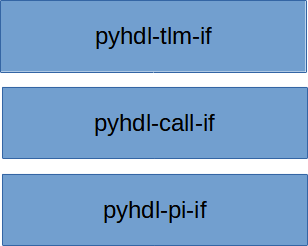

########
Overview
########

PyHDL-IF implements a procedural interface between Python and
various HDL simulator APIs. The library focuses on simplifying 
the task of implementing interactions between HDL and Python at a 
variety of abstraction levels.

Procedural-Interface API
************************
The procedural interface API is the lowest-level PyHDL-IF
API. Because of this, it is also the most HDL- and simulator-specific.

There are two halves to the API:

- Make an implementation of the Python C API available as a HDL-native API.
- Make an implementation of the HDL-provided foreign-language interface 
  available in Python.

Call-Interface API
******************
The *Call Interface* API enables users to create pairs of communicating 
objects, where one object lives in Python, the other lives in HDL.

TLM API
*******
The TLM interface implements a FIFO-based interface between Python and
Bus Functional Models (BFMs).

Pytest Runner
*************
The pytest runner enables execution of async Python tests directly from 
SystemVerilog testbenches. Tests benefit from pytest's assertion rewriting 
for better error messages while running asynchronously within the HDL 
simulation event loop. See :doc:`pytest_runner` for details. 

Status and Roadmap
==================

PyHDL-IF is still under active development. The information here attempts
to capture the status of available features and a roadmap of planned 
future features.

.. list-table:: Platform Support
    :header-rows: 1

    * - Linux
      - Windows (x86_64)
      - MacOS (x86_64)
      - MacOS (arm64)
    * - Yes
      - Planned
      - Planned
      - Planned

The native-compiled portions of PyHDL-IF are compiled according
to the relevant Python version-specific requirements. 
If your favorite platform is not listed above and you would like 
PyHDL-IF to support, please file a feature-request ticket and
note the platform and the simulator you typically use on that 
platform.

.. list-table:: HDL Calling Python API
    :header-rows: 1

    * - DPI
      - FLI
      - VPI
      - VHPI
    * - Yes
      - Planned
      - Planned
      - Planned

Supporting HDL calls to the Python API allows HDL to interact with
Python as if it was a Python extension by calling the Python C API.
    
.. list-table:: Python calling HDL API
    :header-rows: 1

    * - DPI
      - FLI
      - VPI
      - VHPI
    * - Yes
      - Planned
      - Planned
      - Planned

Support Python calls to an HDL API allows Python to interact with
simulator APIs as if it were a shared library loaded by the 
simulator. For example, support for VPI allows a Python module
to walk through the design design hierachy and implement 
system tasks that the HDL can call.

